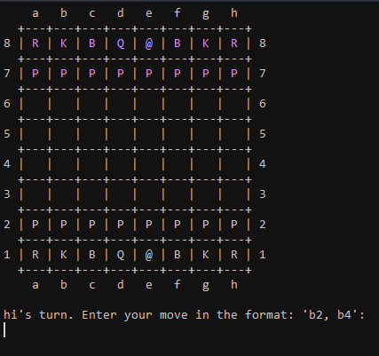

# Command Line Chess in Ruby
The goal of this project was to create a command line version of chess in Ruby.

The project is from [The Odin Project](https://www.theodinproject.com/courses/ruby-programming/lessons/ruby-final-project).



##Installation
If you have Ruby installed: 
```
$ git clone https://github.com/ellielle/chess.git
$ cd chess/lib
$ ruby game.rb
```
For Windows users without Ruby installed, you can get the release from [here](https://github.com/ellielle/chess/releases). It contains everything you need to run it, and you won't need to install Ruby. This was built using [OCRA](https://github.com/larsch/ocra).
